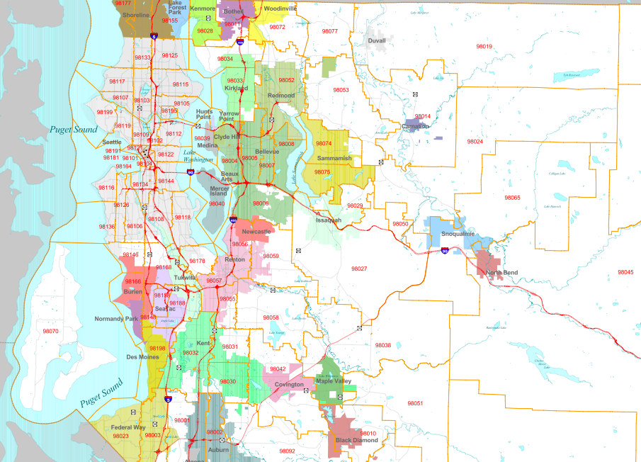
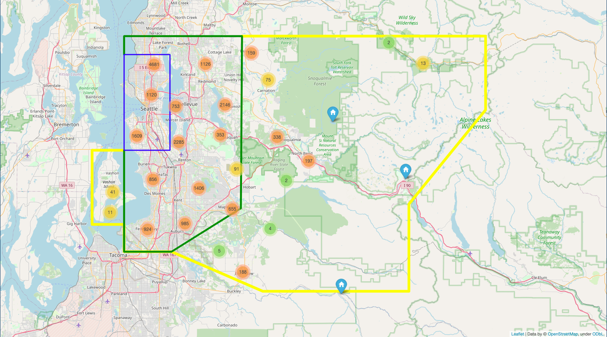

# Project 2 Name

**Authors**: Evan Johnson, Isaac Barrera, Seung Lee

## Project 2 BLUF Statement

Task: Redfin / Zillow are moving into King County. They anticipate home prices in this area to rise in the upcoming future, but do not have an accurate model to estimate current house prices. 

## Business Problem

Our company wants to beat the competition to the market but also is weary of overpaying for homes. To pick the best investments, we are here to create home price models of the King County area. By using metrics such as square feet, condition, and features (view, waterfront) we will create a model that will reflect future home prices in the area.

Job: Clean the data on recent house sells in King County and find out what metrics / features are most important in gauging house price. Then, create a linear regression model that will account for variability in home price using input variables.


## Data and Methods

We obtained the data from Kings County.

Within the obtained data, there were numerous columns that contained categorical variables that will cause problems when fitting a linear regression line. To make the dataset continuous, we had to change the columns 'waterfront', 'condition', and 'view'.
There were a couple of columns with missing values and we chose to fill them with 'NO' or '0' and safely assume that house doesnt have the unlisted feature. 

Lastly, in order to reduce the impact of outliers in our data, we deleted features that are 3 standard deviations from the mean. This left us with a final dataset of N = 20,028.

Our cleaned data is uploaded to a new csv, 'cleaned_data.csv' within our data folder.

With the cleaned dataset, we used Python libraries 'sklearn' to create a train/test split and scale and transform. Then we used linear regression and RFE to select the most impactful features to pass into OLS.

With 'statsmodels' we created our model summary that output the adjusted rsquared, along with the coefficients of our features.

To validate our model, we tested for the assumptions of linear regression.
- Check Normal Distributions of Input Variables
- Heteroskedasticity - lack of trend in errors
- Linearity and Multicollinearity - are input variables too closely correlated

## Results
Developed model that accounts for 60% of variability in home price using input variables that you as a house flipper would care about.
'sqft_living', 'view', 'grade', and 'urban / suburb / rural' are the most important features in home price.

### Model 1 - Simple Model

To build an accurate model that could be explained, we chose the variables; 'sqft_living', 'view', 'grade' and 'relative_living_area' for our first model. 'relative_living_area' was engineered by dividing columns 'sqft_living' by 'sqft_living15'. If this variable is above 1, then that means that the particular home we are looking into has a larger living area than the average of 15 houses around it.

Our first model could account for just a little over 50% of home price with our chosen variables. Because there are still another 50% we did not factor into our model, we decided to engineer more features to include.
(Adjusted R-Squared ~ 0.505)

### Model 2 - Advanced Model

In our Advanced Model, the feature we engineered was population / city density. By grouping 'urban', 'suburban', and 'rural' areas into their respective categories, we figured our model would be more accurate. 

To do this, we looked at a zipcode map of King's County



The 'urban' area is well defined in grey (Seattle). On the outskirts of Seattle, the map shows 'incorporated' areas in color, representing 'suburbs'. Areas that dominated by lack of color were thrown into the 'rural' bin. After doing so, our map of King County looks like this:



With these features, our model increased its Adjusted R-squared by around 10%. This proves that our model with engineered features is increasing our model's accuracy. 


## Conclusions

Based on our data, it is clear that the location of the home has a large factor of its price. By binning the zipcodes into three categories, 'urban', 'suburban', and 'rural', we were able to create a more accurate model. 

## Future Investigations

In the future, by further binning zipcodes using metrics such as geographical income, poverty, and crime rates, we can expect to have an even more accurate model.

## For More Information

Please review our full analysis in [our Jupyter Notebook](./Index.ipynb) or our [presentation](./Slides.pdf).

For any additional questions, please contact **Evan Johnson | ewjohn127@gmail.com, Isaac Barrera | ibarr24@gmail.com, Seung Lee | baekho5767@gmail.com**

## Repository Structure

You are in the README.md. The 'Simple_Model.ipynb' and 'Advanced_Model.ipynb' contains the 'simple' and 'advanced' model jupyter notebooks that explains our data science steps for you to replicate! 


Our 'Presentation.pdf' contains our google slides presentation that sums up important information for our audience. In 'data' you will be able to see the dataset we worked with. Likewise, 'Images' will contain images used in this 'README.md' generated from code and as well as from the web.

```
├── README.md                           <- The top-level README for reviewers of this project
├── Simple_Model.ipynb                  <- Narrative documentation of analysis in creating the Simple_Model
├── Advanced_model.ipynb                <- Narrative documentation of analysis in creating the Advanced_Model
├── Data_Exploration.ipynb              <- Process of data cleaning + separating clean from uncleaned data
├── images                              <- Holds images used in this README.md  
├── data                                <- Both sourced externally and generated from code
└── Presentation.pdf                    <- PDF version of project presentation
```

