# Develop an Inferential Model for Understanding the Variance in Home Prices of King County Washington, USA

**Authors**: Evan Johnson, Isaac Barrera, Seung Lee

Task: Our stakeholder is a house flipping company based in King County. They anticipate home prices in this area to rise in the upcoming future, but do not have an accurate model to estimate current house prices. 

## Business Problem

Job: Clean the data on recent house sales in King County and find out what metrics / features are most important in gauging house price. Then, create a linear regression model that will account for variability in home price using input variables.

Our company wants to beat the competition to the market but also is weary of overpaying for homes. To pick the best investments, we are here to create home price models of the King County area. By using metrics such as square feet, condition, and features (that we will create) we created a model that could account for the variabilities in home price.

Our final model determined that livable space, construction quality, and location were the most important factors in home pricing in King County.


## Data and Methods

Our dataset contained records of home sales in King County from years 2014 and 2015.

Within the obtained data, there were numerous columns that contained categorical variables that will cause problems when fitting a linear regression line. To make the dataset continuous, we had to change the columns 'waterfront', 'condition', and 'view'.

There were a couple of columns with missing values and we chose to fill them with 'NO' or '0' and safely assume that house doesnt have the unlisted feature.

In order to reduce the impact of outliers in our data, we deleted features that are 3 standard deviations from the mean.

After dropping the duplicates in the dataset, we were left with a final dataset of N = 20,361 houses.

Our cleaned data is uploaded to a new csv, 'cleaned_data.csv' within our data folder.

### Methods

Because of the nature of the business of home flipping, it is ideal to target 'cookie cutter' houses to easily determine the price of a home when fixed up to its neighbor's condition.

The cookie cutter model allows us to easily identify under-appreciated properties in order to quickly fix them up and sale at market price.


With the cleaned dataset, we used Python libraries 'sklearn' to create a train/test split and scale and transform. Then we used linear regression and RFE to select the most impactful features to pass into OLS regression.

With Python library 'statsmodels', we created our model summary that output the adjusted rsquared, along with the coefficients of our features.

To validate our model, we tested for the assumptions of linear regression.
- Check Normal Distributions of Input Variables
- Heteroskedasticity - lack of trend in errors
- Linearity and Multicollinearity - are input variables too closely correlated

## Results
Developed model that accounts for 60% of variability in home price using input variables that you as a house flipper would care about.
'sqft_living', 'view', 'grade', 'relative_living_area', and 'urban / suburb / rural' are the most important features in home price.

### Model 1 - Simple Model

To build an accurate model that could be explained, we chose the variables; 'sqft_living', 'view', 'grade' and 'relative_living_area' for our first model. 'relative_living_area' was engineered by dividing columns 'sqft_living' by 'sqft_living15'. If this variable is above 1, then that means that the particular home we are looking into has a larger living area than the average of 15 houses around it.

Our first model could account for just a little over 50% of home price with our chosen variables. Because there are still another 50% we did not factor into our model, we decided to engineer more features to include.
(Adjusted R-Squared ~ 0.505)
### Trained Set
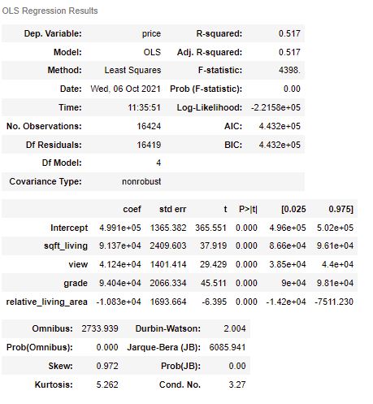

### Test Set
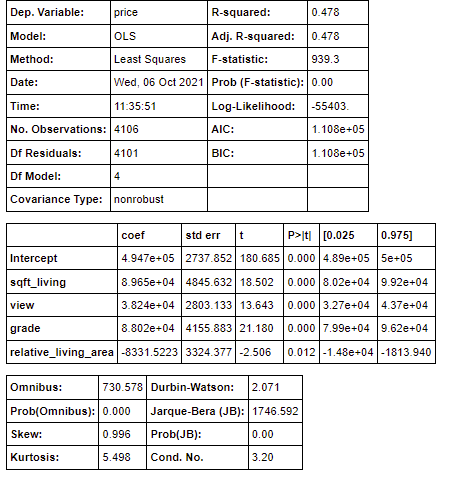
### Model 2 - Advanced Model

In our Advanced Model, the feature we engineered was population / city density. By grouping 'urban', 'suburban', and 'rural' areas into their respective categories, we figured our model would be more accurate. 

To do this, we looked at a zipcode map of King's County

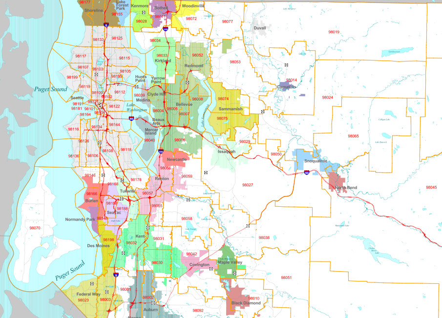

The 'urban' area is well defined in grey (Seattle). On the outskirts of Seattle, the map shows 'incorporated' areas in color, representing 'suburbs'. Areas that dominated by lack of color were thrown into the 'rural' bin. After doing so, our map of King County looks like this:

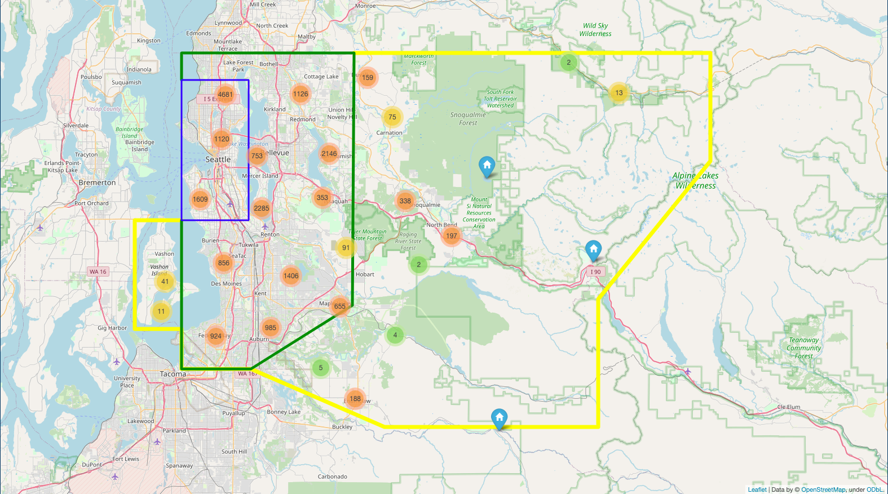

With these features, our model increased its Adjusted R-squared by around 10%. This proves that our model with engineered features is increasing our model's accuracy. 

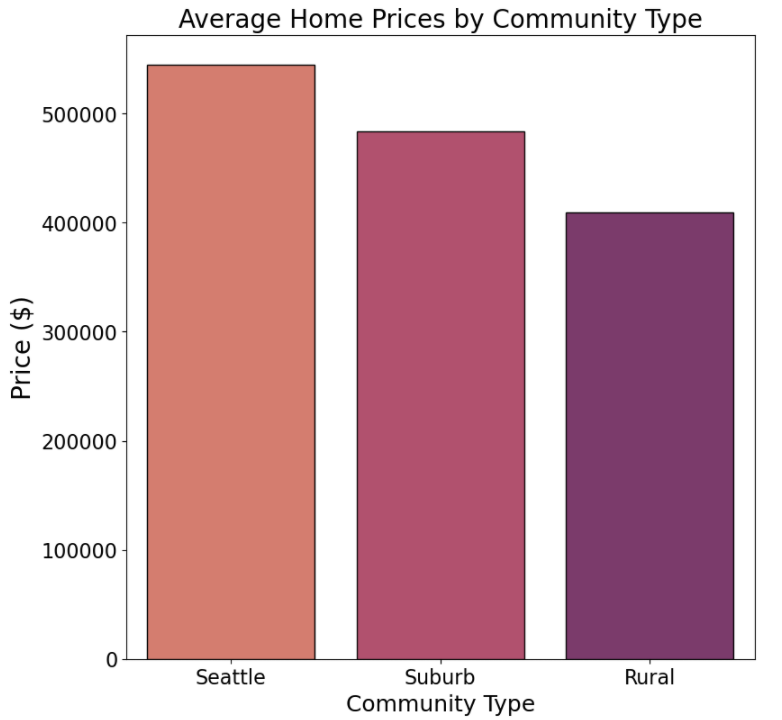

Because there is a difference in price in relation to city density, creating variables to account for density improved our model performance.

### Training Set
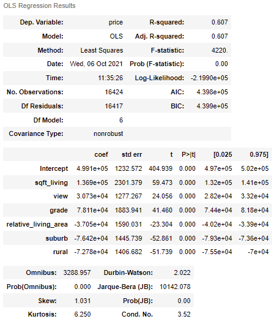

### Test Set
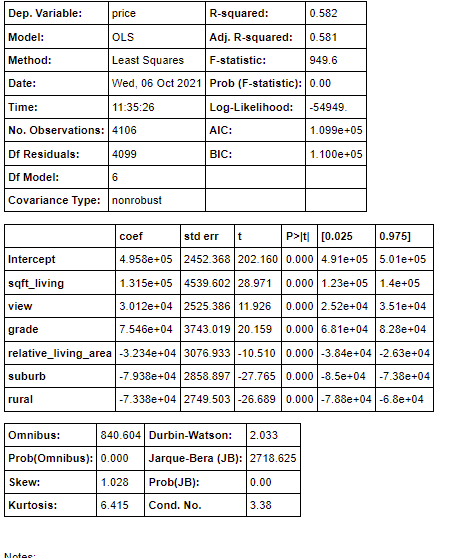

## Model Validation

### Normal Distribution of Input Variables

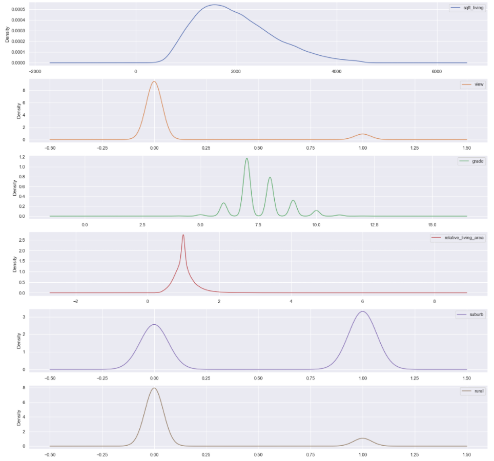

Our input variables have a relatively normal distribution. The input variables that have multiple peaks are due to it being categorical and thus cannot be in-between two values.

### Checking Distribution of Residuals

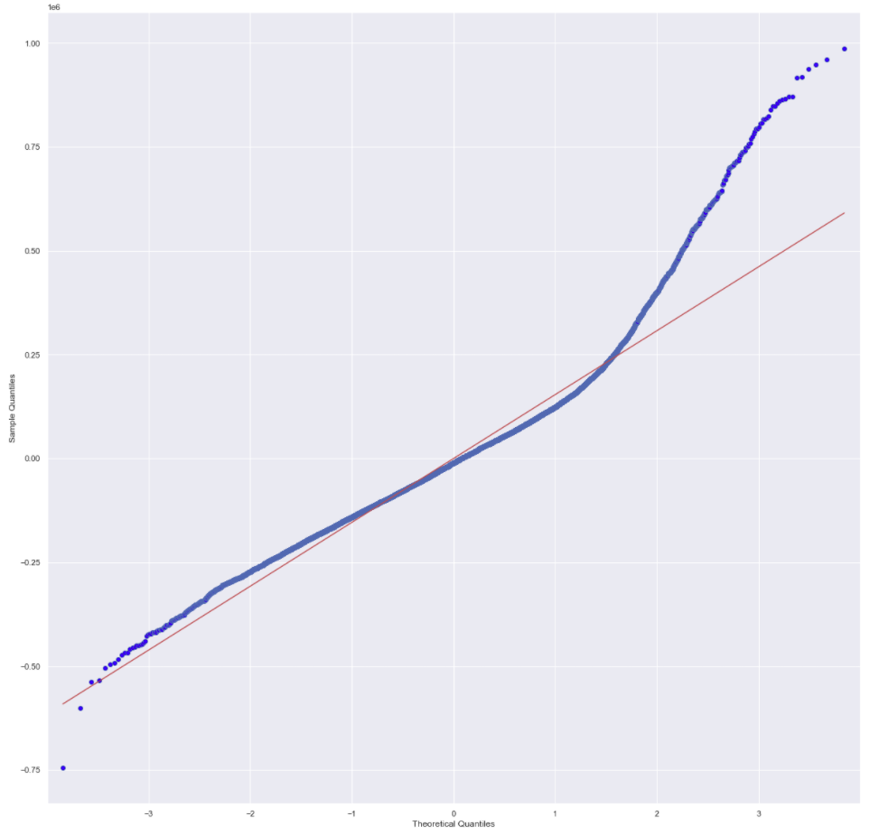

Our model does not encapture all the factors that affect price, however our model does accurately capture a large portion of the data.

### Checking for Heteroskedasticity

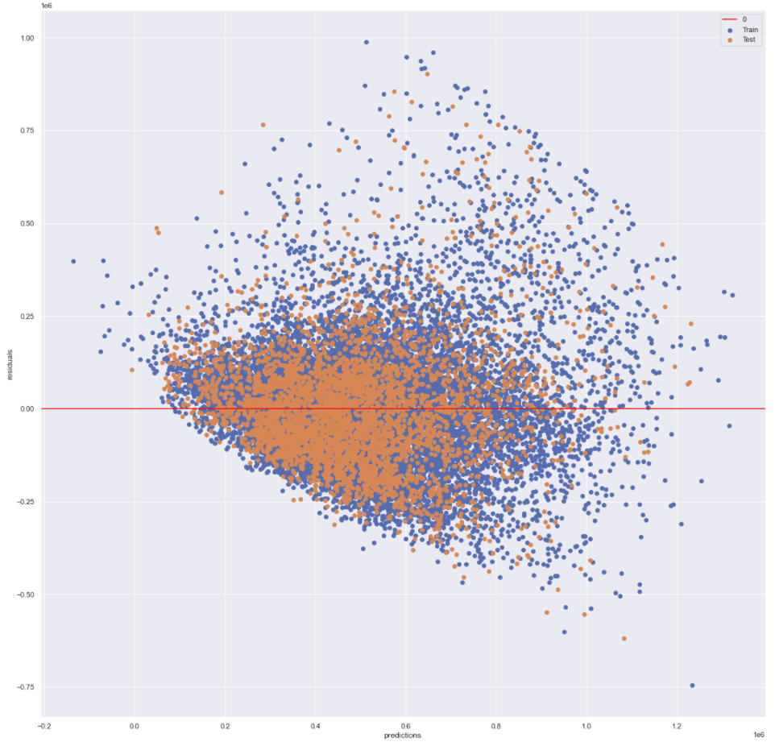

Ideally, we would want to see a random scatter plot with no trend. Although the points do seem random, there does seem to be some sort of trend as the points resemble a trapizoid shape with a concentration of points in left side of our plot.

### Checking for Multicollinearity

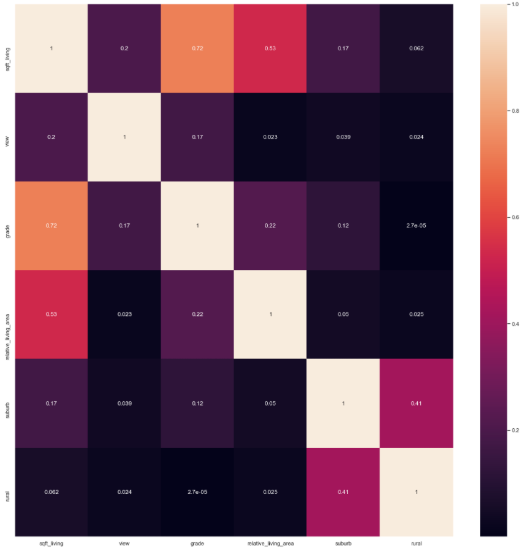

When checking for collinearity, we do find that 'grade' and 'sqft_living' are highly correlated ( > .7). This does raise a flag, however grade of the house and sqft_living should be independent features of the house so we feel confident in leaving it in our model.

## Conclusions

Based on our data, it is clear that the location of the home has a large factor of its price. By binning the zipcodes into three categories, 'urban', 'suburban', and 'rural', we were able to create a more accurate model. 

Moving away from Seattle decreases the value of the home, on average.
The two most important factors in your homes price are livable space, and construction grade.

### Limitations

When checking for the assumptions of linearity, we did come across some problems. However, our model does perform better than the base, but the results show that our model can still be improved.

Our data was limited to years 2014-2015. Preferably, we would want more data to create a better model.

## Future Investigations

In the future, by further binning zipcodes using metrics such as geographical income, poverty, and crime rates, we can expect to have an even more accurate model.

## For More Information

Please review our full analysis in [our Jupyter Notebook](HomeFlip_KingCounty_Model_Notebook.ipynb) or our [presentation](HomeFlip_KingCounty_Model_Presentation.pdf).

For any additional questions, please contact **Evan Johnson | ewjohn127@gmail.com, Isaac Barrera | ibarr24@gmail.com, Seung Lee | baekho5767@gmail.com**

## Repository Structure

You are in the README.md. The appendix contains our model building process. Within it, you will find jupyter notebooks that explains our data science steps for you to replicate! 


Our 'HomeFlip_KingCounty_Model_Presentation.pdf' contains our google slides presentation that sums up important information for our audience. In 'data' you will be able to see the dataset we worked with. Likewise, 'Images' will contain images used in this 'README.md' generated from code and as well as from the web.

```
├── README.md                              <- The top-level README for reviewers of this project
├── appendix.ipynb                         <- Narrative documentation of analysis in creating the Models in jupyter notebook
├── data                                   <- Both sourced externally and generated from code
├── images                                 <- Holds images used in this README.md  
├── HomeFlip_kingCounty_Price_Model.ipynb  <- Narrative documentation of analysis explaining the Models in jupyter notebook
├── HomeFlip_KingCounty_Model_Notebook.pdf <- Narrative documentation of analysis explaining the Models in PDF!
└── HomeFlip_KingCounty_Model_Presentation.pdf <- PDF version of project presentation
```

